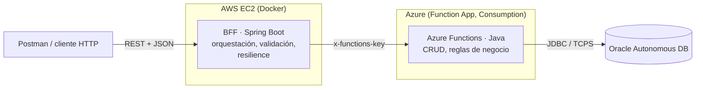

# Sistema de Gestión de Usuarios y Roles

Sistema serverless para el CRUD de usuarios y roles, construido con un
**BFF** (Backend For Frontend) que orquesta llamadas a **Azure Functions**,
las que ejecutan la lógica de dominio y el acceso a una base de datos
**Oracle Autonomous Database**.

```
Postman  →  BFF (Spring Boot, Docker/EC2)  →  Azure Functions (Java)  →  Oracle ADB
```

Este documento explica la arquitectura, las decisiones técnicas y cómo
probar el sistema. El detalle completo de arquitectura vive en
[`CLAUDE.md`](CLAUDE.md) y el detalle del requerimiento de negocio en
[`docs/gestion-usuarios-roles.md`](docs/gestion-usuarios-roles.md) — este
README es un resumen orientado a presentar el desarrollo.

## 1. Arquitectura



| Componente | Responsabilidad | Por qué se usó |
|---|---|---|
| **BFF** (Spring Boot) | Expone la API REST, valida el input (Bean Validation), orquesta las llamadas a las Functions, aísla fallos por dependencia (Resilience4j) y devuelve un contrato de error único. **No** tiene acceso a Oracle. | Es la pieza pedida por el requerimiento como "microservicio en Docker + EC2"; separa al consumidor (Postman/frontend) del contrato interno de las Functions. |
| **Azure Functions** (Java) | Implementa el CRUD real de `Usuario`/`Rol`, las reglas de negocio (borrado lógico, unicidad, bloqueo de eliminación de un rol en uso) y el único acceso a Oracle. | Cumple el requisito de que la lógica CRUD corra en funciones serverless; Java se eligió para compartir lenguaje/convenciones con el BFF. |
| **Oracle Autonomous Database** | Persistencia de `USUARIOS`, `ROLES` y la relación N:M `USUARIO_ROL`. | Motor provisto por la cátedra/infraestructura disponible (OCI Free Tier). |

El BFF y las Functions son **dos proyectos Maven independientes** (sin
build compartido) que solo se comunican por HTTP — cada uno con su propio
ciclo de despliegue (EC2 vs Azure), como corresponde a componentes
desacoplados en una arquitectura serverless/BFF.

## 2. Stack técnico

| | BFF | Azure Functions |
|---|---|---|
| Lenguaje | Java 21 | Java 21 |
| Framework | Spring Boot 3.3 | **Ninguno** (Azure Functions Java Worker v4 puro) |
| Build | Maven | Maven (`azure-functions-maven-plugin`) |
| Cliente HTTP | `RestClient` (Spring 6) | — |
| Acceso a datos | Ninguno (no toca Oracle) | JDBC directo + HikariCP |
| Resiliencia | Resilience4j (circuit breaker + retry, aislado por dominio) | Reintentos a nivel de driver JDBC (connect descriptor) |
| Despliegue | Docker → EC2 (AWS) | `azure-functions-maven-plugin` → Function App (Azure) |

**Por qué sin Spring en las Functions**: en un runtime serverless, levantar
un `ApplicationContext` completo en cada cold start tiene un costo que no
se justifica para funciones HTTP simples — se prefirió el worker Java
liviano de Azure Functions.

## 3. Estructura del repositorio

```
.
├── bff/                          Spring Boot — BFF
│   ├── src/main/java/com/empresa/bff/
│   │   ├── config/               RestClient + Resilience4j + function key
│   │   ├── common/
│   │   │   ├── exception/        GlobalExceptionHandler, ApiError
│   │   │   └── web/              Correlation-id (filtro + interceptor)
│   │   ├── usuarios/             controller / service / client / dto
│   │   └── roles/                controller / service / client / dto
│   ├── Dockerfile                build multi-stage (Maven → JRE Alpine)
│   └── .env.example              variables requeridas para correr en EC2
├── azure-functions/              Java, sin Spring — Azure Functions
│   ├── src/main/java/com/empresa/functions/
│   │   ├── common/               DataSourceProvider, JSON/HTTP utils, excepciones
│   │   ├── usuarios/             Functions / service / repository / dto
│   │   └── roles/                Functions / service / repository / dto
│   └── sql/schema.sql            DDL de Oracle
├── docs/gestion-usuarios-roles.md  Definiciones del requerimiento
├── postman/                      Colección Postman (BFF + Functions)
└── CLAUDE.md                     Fuente de verdad de arquitectura y stack
```

## 4. Modelo de datos

`Usuario` y `Rol` se relacionan **N:M** vía la tabla puente `USUARIO_ROL`.
El DDL completo está en [`azure-functions/sql/schema.sql`](azure-functions/sql/schema.sql):

```sql
USUARIOS (ID IDENTITY PK, USERNAME UNIQUE, EMAIL UNIQUE, NOMBRE_COMPLETO, ESTADO, FECHA_CREACION, FECHA_MODIF)
ROLES    (ID IDENTITY PK, NOMBRE UNIQUE, DESCRIPCION, ESTADO, FECHA_CREACION)
USUARIO_ROL (USUARIO_ID FK, ROL_ID FK, FECHA_ASIGNACION, PK compuesta)
```

Decisiones de modelo (detalladas en `docs/gestion-usuarios-roles.md §10`):
borrado lógico (`ESTADO`), sin credenciales de login en `Usuario` (es una
entidad de catálogo, no de autenticación), IDs generados con
`GENERATED ALWAYS AS IDENTITY`.

## 5. Endpoints

### BFF (`http://localhost:8080` en dev, EC2 en prod)

| Recurso | Verbo | Ruta |
|---|---|---|
| Usuario | `POST` `GET` `GET` `PUT` `DELETE` | `/usuarios`, `/usuarios`, `/usuarios/{id}`, `/usuarios/{id}`, `/usuarios/{id}` |
| Usuario–Rol | `POST` `DELETE` | `/usuarios/{id}/roles`, `/usuarios/{id}/roles/{rolId}` |
| Rol | `POST` `GET` `GET` `PUT` `DELETE` | `/roles`, `/roles`, `/roles/{id}`, `/roles/{id}`, `/roles/{id}` |

### Azure Functions (`https://fn-usuarios-roles.azurewebsites.net/api`)

Mismas rutas, con auth `x-functions-key` (ver `?code=` o header). El BFF
llama 1:1 a cada Function; el detalle función↔operación está en
`docs/gestion-usuarios-roles.md §6`.

## 6. Buenas prácticas implementadas

- **Capas separadas por dominio**, no por capa global: `usuarios/` y
  `roles/` con su propio `controller/service/client` (BFF) o
  `Functions/service/repository` (Azure Functions) — evita que
  `controller/`, `service/`, etc. se vuelvan carpetas gigantes sin
  relación al sumar dominios.
- **Validación de entrada con Bean Validation en ambos lados**: `@Valid`
  en el BFF (`@NotBlank`, `@Email`, `@Size`, `@NotNull` en los DTOs de
  request) para fallar rápido antes de llegar a la Function, y la misma
  validación repetida en las Functions vía `ValidationUtil` — como
  también son invocables directamente (sin pasar por el BFF), no basta
  con validar solo del lado del BFF.
- **Health check por dependencia**: un `HealthIndicator` de Actuator por
  cada Azure Function (`usuariosFunction`, `rolesFunction`), visibles en
  `/actuator/health` — permite ver cuál dependencia específica está
  fallando en vez de solo un status genérico de la app.
- **Contrato de error único**: `GlobalExceptionHandler` en el BFF traduce
  validación (`400`), errores de la Function (propaga el status real,
  sin reinventar una traducción), circuito abierto de Resilience4j
  (`503`) y timeout (`504`).
- **Aislamiento de fallos por dependencia**: circuit breaker + retry de
  Resilience4j configurados **por client** (`usuariosFunction`,
  `rolesFunction`) — una Function lenta no degrada la otra. El retry se
  omite deliberadamente en operaciones no idempotentes (crear, asignar
  rol) para no duplicar efectos ante un timeout.
- **Correlation-id de punta a punta**: filtro genera/propaga
  `X-Correlation-Id` desde el request entrante hasta la llamada a la
  Function, presente en los logs del BFF vía MDC.
- **Pool de conexiones como singleton en las Functions**
  (`DataSourceProvider`, patrón double-checked locking): evita crear un
  pool nuevo en cada invocación "caliente", que agotaría las conexiones
  de Oracle.
- **Excepciones tipadas en las Functions** (`NotFoundException`,
  `ConflictException`, `ValidationException`) mapeadas a status HTTP
  correctos (`404`, `409`, `400`) en un manejador centralizado por
  Function, con log del error no controlado antes de responder `500`.
- **Reglas de negocio en la capa de datos**: unicidad de
  `username`/`email` vía constraint de Oracle (no un `SELECT` previo,
  para evitar condiciones de carrera), bloqueo de eliminación de un rol
  con usuarios asignados.
- **Secretos fuera del repositorio**: `local.settings.json` (Functions) y
  `.env` (BFF) están gitignorados; `.env.example` documenta qué
  variables se necesitan sin exponer valores reales.

## 7. Observabilidad

- **Application Insights** queda asociado automáticamente a la Function
  App al desplegar (`host.json` con `applicationInsights.samplingSettings`
  habilitado) — permite ver invocaciones, duración y excepciones desde
  Azure Monitor.
- Cada `Function` centraliza el manejo de errores y loguea las
  excepciones no controladas vía `context.getLogger()` antes de
  responder, lo que las deja visibles en Application Insights
  (`exceptions` / `traces`).
- El BFF propaga el `correlation-id` en sus logs (`logging.pattern.level`
  en `application.yml`), para poder rastrear un request de punta a
  punta cuando haya más integraciones.

## 8. Cómo probar

**Local (BFF + Functions corriendo en la máquina):**

```bash
# Azure Functions
cd azure-functions
mvn clean package
func start                      # http://localhost:7071

# BFF, en otra terminal
cd bff
mvn clean package
java -jar target/bff-0.1.0-SNAPSHOT.jar --spring.profiles.active=dev
                                 # http://localhost:8080
```

**Contra Azure ya desplegado**: correr el BFF con `--spring.profiles.active=prod`
y las variables de [`bff/.env.example`](bff/.env.example) completas (`AZURE_FUNCTIONS_BASE_URL`,
`AZURE_FUNCTIONS_KEY`) apuntando a `https://fn-usuarios-roles.azurewebsites.net`.

**Postman**: importar [`postman/usuarios-roles.postman_collection.json`](postman/usuarios-roles.postman_collection.json)
(25 requests, carpetas `BFF` y `Azure Functions`, ambas con CRUD completo
de usuarios/roles + asignar/quitar rol). Las variables de colección
(`bffUrl`, `functionsUrl`, `functionKey`, `usuarioId`, `rolId`) se
completan según el ambiente a probar — el archivo no trae ningún secreto
cargado por diseño.

## 9. Despliegue actual

- **Azure Functions**: desplegado y verificado funcionando end-to-end
  contra Oracle — Function App `fn-usuarios-roles`, resource group
  `rg-usuarios-roles`, región `East US`, plan **Consumption**.
- **BFF**: dockerizado (`bff/Dockerfile`, build multi-stage, usuario no
  root) y verificado funcionando localmente contra la Function App real;
  **el despliegue en la instancia EC2 queda como siguiente paso** (ver
  sección 10).

## 10. Estado actual y próximos pasos

Transparencia sobre lo que falta cerrar:

- [X] **Desplegar el contenedor del BFF en una instancia EC2** — hoy el
      Dockerfile está listo y probado localmente, pero el flujo
      Postman→BFF(EC2)→Functions→DB no se ha ejecutado de punta a punta
      con el BFF corriendo en AWS.
- [ ] **Endurecer el acceso de red a Oracle**: la ACL de la Autonomous
      Database está abierta (`0.0.0.0/0`) porque el plan Consumption de
      Azure no expone un set chico y estable de IPs de salida. Alternativas
      evaluadas: Function App Premium + VNET/NAT Gateway, u Oracle Private
      Endpoint.
- [ ] **Herramienta de migraciones** (Flyway/Liquibase) — hoy `schema.sql`
      se aplica manualmente.

## Créditos

Desarrollado con [Claude Code](https://claude.com/claude-code) como par de
desarrollo, incluyendo diseño de arquitectura, scaffold de ambos
proyectos, despliegue real a Azure y depuración de un bug de conexiones
concurrentes a Oracle detectado en producción.
