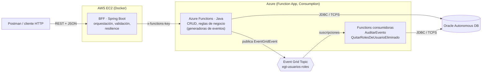
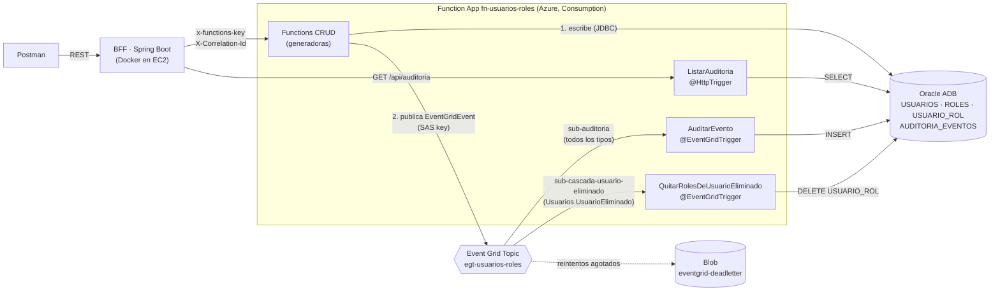
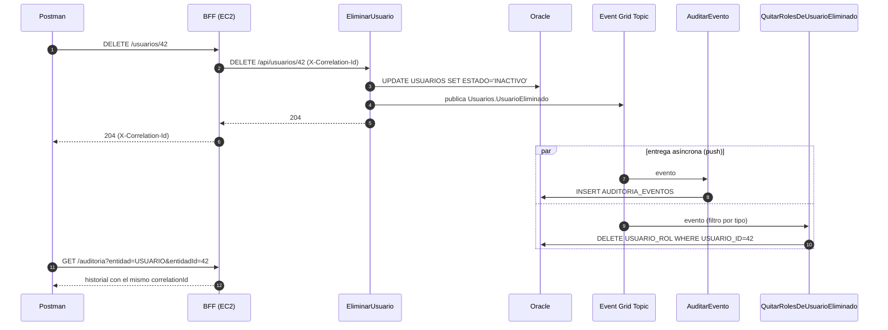

# Sistema de Gestión de Usuarios y Roles

Sistema serverless para el CRUD de usuarios y roles, construido con un
**BFF** (Backend For Frontend) que orquesta llamadas a **Azure Functions**,
las que ejecutan la lógica de dominio y el acceso a una base de datos
**Oracle Autonomous Database**.

```
Postman  →  BFF (Spring Boot, Docker/EC2)  →  Azure Functions (Java)  →  Oracle ADB
                                                   │ eventos de dominio
                                                   ▼
                                      Azure Event Grid  →  Functions consumidoras (auditoría, cascada)
```

Este documento explica la arquitectura, las decisiones técnicas y cómo
probar el sistema. El detalle completo de arquitectura vive en
[`CLAUDE.md`](CLAUDE.md) y el detalle del requerimiento de negocio en
[`docs/gestion-usuarios-roles.md`](docs/gestion-usuarios-roles.md) — este
README es un resumen orientado a presentar el desarrollo.

## 1. Arquitectura


```mermaid
flowchart LR
    P[Postman / cliente HTTP] -->|REST + JSON| BFF
    subgraph EC2["AWS EC2 (Docker)"]
        BFF["BFF · Spring Boot\norquestación, validación,\nresilience"]
    end
    BFF -->|x-functions-key| FN
    subgraph AZ["Azure (Function App, Consumption)"]
        FN["Azure Functions · Java\nCRUD, reglas de negocio\n(generadoras de eventos)"]
        CONS["Functions consumidoras\nAuditarEvento\nQuitarRolesDeUsuarioEliminado"]
    end
    FN -->|JDBC / TCPS| DB[(Oracle Autonomous DB)]
    FN -->|publica EventGridEvent| EG{{"Event Grid Topic\negt-usuarios-roles"}}
    EG -->|suscripciones| CONS
    CONS -->|JDBC / TCPS| DB
```

El detalle del flujo de eventos (topic, suscripciones, catálogo de eventos)
está en la [sección 6](#6-arquitectura-orientada-a-eventos-azure-event-grid).

| Componente | Responsabilidad | Por qué se usó |
|---|---|---|
| **BFF** (Spring Boot) | Expone la API REST, valida el input (Bean Validation), orquesta las llamadas a las Functions, aísla fallos por dependencia (Resilience4j) y devuelve un contrato de error único. **No** tiene acceso a Oracle. | Es la pieza pedida por el requerimiento como "microservicio en Docker + EC2"; separa al consumidor (Postman/frontend) del contrato interno de las Functions. |
| **Azure Functions** (Java) | Implementa el CRUD real de `Usuario`/`Rol`, las reglas de negocio (borrado lógico, unicidad, bloqueo de eliminación de un rol en uso) y el único acceso a Oracle. Las Functions CRUD además **publican eventos de dominio**, y dos Functions **consumidoras** reaccionan a ellos. | Cumple el requisito de que la lógica CRUD corra en funciones serverless; Java se eligió para compartir lenguaje/convenciones con el BFF. |
| **Azure Event Grid** (Topic) | Recibe los eventos de dominio (`UsuarioCreado`, `RolAsignado`, `UsuarioEliminado`…) y los entrega por push a las Functions consumidoras según sus suscripciones, con reintentos y dead-letter. | Requisito de la Exp3: resolver parte del requerimiento con una arquitectura orientada a eventos (ver §6). |
| **Oracle Autonomous Database** | Persistencia de `USUARIOS`, `ROLES` y la relación N:M `USUARIO_ROL`. | Motor provisto por la cátedra/infraestructura disponible (OCI Free Tier). |

El BFF y las Functions son **dos proyectos Maven independientes** (sin
build compartido) que solo se comunican por HTTP — cada uno con su propio
ciclo de despliegue (EC2 vs Azure), como corresponde a componentes
desacoplados en una arquitectura serverless/BFF.

## 2. Stack técnico

| | BFF | Azure Functions |
|---|---|---|
| Lenguaje | Java 21 | Java 21 |
| Framework | Spring Boot 3.3 | **Ninguno** (Azure Functions Java Worker v4 puro) |
| Build | Maven | Maven (`azure-functions-maven-plugin`) |
| Cliente HTTP | `RestClient` (Spring 6) | — |
| Acceso a datos | Ninguno (no toca Oracle) | JDBC directo + HikariCP |
| GraphQL | — | `graphql-java` puro, solo lecturas (`usuarios`, `roles`) |
| Resiliencia | Resilience4j (circuit breaker + retry, aislado por dominio) | Reintentos a nivel de driver JDBC (connect descriptor) |
| Eventos | — | Azure Event Grid: publicación con `azure-messaging-eventgrid`, consumo con `@EventGridTrigger` |
| Despliegue | Docker → EC2 (AWS) | `azure-functions-maven-plugin` → Function App (Azure) |

**Por qué sin Spring en las Functions**: en un runtime serverless, levantar
un `ApplicationContext` completo en cada cold start tiene un costo que no
se justifica para funciones HTTP simples — se prefirió el worker Java
liviano de Azure Functions.

## 3. Estructura del repositorio

```
.
├── bff/                          Spring Boot — BFF
│   ├── src/main/java/com/empresa/bff/
│   │   ├── config/               RestClient + Resilience4j + function key
│   │   ├── common/
│   │   │   ├── exception/        GlobalExceptionHandler, ApiError
│   │   │   └── web/              Correlation-id (filtro + interceptor)
│   │   ├── usuarios/             controller / service / client / dto
│   │   ├── roles/                controller / service / client / dto
│   │   └── auditoria/            controller / service / client / dto (GET /auditoria)
│   ├── Dockerfile                build multi-stage (Maven → JRE Alpine)
│   └── .env.example              variables requeridas para correr en EC2
├── azure-functions/              Java, sin Spring — Azure Functions
│   ├── src/main/java/com/empresa/functions/
│   │   ├── common/                    DataSourceProvider, JSON/HTTP utils, excepciones, GraphQLHttpHandler
│   │   │   └── eventos/               EventGridEventPublisher, EventoDominio, TiposEvento, EventoRecibido
│   │   ├── usuarios/                  Functions REST / service / repository / dto
│   │   │   ├── UsuarioEventosFunction consumidora: QuitarRolesDeUsuarioEliminado
│   │   │   └── graphql/               UsuarioGraphQLSchema (queries: usuarios, usuario)
│   │   ├── roles/                     Functions REST / service / repository / dto
│   │   │   └── graphql/               RolGraphQLSchema (queries: roles, rol)
│   │   └── auditoria/                 consumidora AuditarEvento + ListarAuditoria (REST)
│   └── sql/                      schema.sql + auditoria_eventos.sql (DDL de Oracle)
├── infra/eventgrid/              setup-eventgrid.sh — topic + suscripciones (az CLI)
├── docs/gestion-usuarios-roles.md  Definiciones del requerimiento
├── postman/                      Colección Postman (BFF + Functions)
└── CLAUDE.md                     Fuente de verdad de arquitectura y stack
```

## 4. Modelo de datos

`Usuario` y `Rol` se relacionan **N:M** vía la tabla puente `USUARIO_ROL`.
El DDL completo está en [`azure-functions/sql/schema.sql`](azure-functions/sql/schema.sql):

```sql
USUARIOS (ID IDENTITY PK, USERNAME UNIQUE, EMAIL UNIQUE, NOMBRE_COMPLETO, ESTADO, FECHA_CREACION, FECHA_MODIF)
ROLES    (ID IDENTITY PK, NOMBRE UNIQUE, DESCRIPCION, ESTADO, FECHA_CREACION)
USUARIO_ROL (USUARIO_ID FK, ROL_ID FK, FECHA_ASIGNACION, PK compuesta)
```

Decisiones de modelo (detalladas en `docs/gestion-usuarios-roles.md §10`):
borrado lógico (`ESTADO`), sin credenciales de login en `Usuario` (es una
entidad de catálogo, no de autenticación), IDs generados con
`GENERATED ALWAYS AS IDENTITY`.

## 5. Endpoints

### BFF (`http://localhost:8080` en dev, EC2 en prod)

| Recurso | Verbo | Ruta |
|---|---|---|
| Usuario | `POST` `GET` `GET` `PUT` `DELETE` | `/usuarios`, `/usuarios`, `/usuarios/{id}`, `/usuarios/{id}`, `/usuarios/{id}` |
| Usuario–Rol | `POST` `DELETE` | `/usuarios/{id}/roles`, `/usuarios/{id}/roles/{rolId}` |
| Rol | `POST` `GET` `GET` `PUT` `DELETE` | `/roles`, `/roles`, `/roles/{id}`, `/roles/{id}`, `/roles/{id}` |
| Auditoría | `GET` | `/auditoria?entidad=USUARIO\|ROL&entidadId={id}&limit={n}` — historial de eventos (ver §6) |

### Azure Functions (`https://fn-usuarios-roles.azurewebsites.net/api`)

Mismas rutas, con auth `x-functions-key` (ver `?code=` o header). El BFF
llama 1:1 a cada Function; el detalle función↔operación está en
`docs/gestion-usuarios-roles.md §6`.

Además de REST, dos Functions exponen **GraphQL** (solo lectura), una por
dominio, con auth `x-functions-key` igual que las REST:

| Endpoint | Queries |
|---|---|
| `POST /api/graphql/usuarios` | `usuarios`, `usuario(id)` — con `roles` anidado |
| `POST /api/graphql/roles` | `roles`, `rol(id)` — con `usuarios` anidado (relación inversa, sin equivalente REST) |

Body: `{"query": "...", "variables": {...}}`. Ejemplo:

```bash
curl -X POST "$FUNCTIONS_URL/api/graphql/roles?code=$FUNCTION_KEY" \
  -H "Content-Type: application/json" \
  -d '{"query":"{ roles { id nombre usuarios { username } } }"}'
```

## 6. Arquitectura orientada a eventos (Azure Event Grid)

**Qué parte del requerimiento resuelve**: el CRUD sigue siendo síncrono
(REST), pero dos necesidades que no deben bloquear ni acoplarse al
request HTTP se resuelven con eventos:

1. **Auditoría**: un historial de cada cambio sobre usuarios, roles y sus
   asignaciones (quién cambió, qué y cuándo, con el `correlationId` del
   request de origen), consultable vía `GET /auditoria` en el BFF.
2. **Cascada al eliminar un usuario**: al eliminar un usuario (borrado
   lógico), sus asignaciones en `USUARIO_ROL` se quitan de forma
   asíncrona. Así un rol no queda bloqueado para siempre (`409`) por estar
   asignado a un usuario que ya no existe.

### Componentes

| Componente | Tipo | Rol en el flujo |
|---|---|---|
| `CrearUsuario`, `ActualizarUsuario`, `EliminarUsuario`, `AsignarRolAUsuario`, `QuitarRolDeUsuario`, `CrearRol`, `ActualizarRol`, `EliminarRol` | Functions HTTP (Java) | **Generadoras**: después de escribir en Oracle publican su evento al topic (`UsuarioService` / `RolService` → `EventGridEventPublisher`). |
| `egt-usuarios-roles` | Event Grid Topic (Event Grid Schema, East US) | Recibe los eventos y los enruta a cada suscripción. |
| `sub-auditoria` | Event Subscription → Azure Function | Todos los tipos de evento → `AuditarEvento`. |
| `sub-cascada-usuario-eliminado` | Event Subscription → Azure Function | Filtro `Usuarios.UsuarioEliminado` → `QuitarRolesDeUsuarioEliminado`. |
| `AuditarEvento` | Function `@EventGridTrigger` (Java) | **Consumidora**: inserta el evento en `AUDITORIA_EVENTOS`. |
| `QuitarRolesDeUsuarioEliminado` | Function `@EventGridTrigger` (Java) | **Consumidora**: borra las filas de `USUARIO_ROL` del usuario eliminado. |
| `ListarAuditoria` + BFF `GET /auditoria` | Function HTTP + endpoint BFF | Cierra el ciclo: expone la auditoría al consumidor de la API. |
| `eventgrid-deadletter` | Blob container | Eventos que agotan los reintentos (10 intentos / 24 h) quedan aquí para revisión. |

### Diagrama de componentes


```mermaid
flowchart LR
    P[Postman] -->|REST| BFF["BFF · Spring Boot\n(Docker en EC2)"]
    BFF -->|"x-functions-key\nX-Correlation-Id"| CRUD

    subgraph FA["Function App fn-usuarios-roles (Azure, Consumption)"]
        CRUD["Functions CRUD\n(generadoras)"]
        AUD["AuditarEvento\n@EventGridTrigger"]
        CAS["QuitarRolesDeUsuarioEliminado\n@EventGridTrigger"]
        LA["ListarAuditoria\n@HttpTrigger"]
    end

    CRUD -->|"1. escribe (JDBC)"| DB[("Oracle ADB\nUSUARIOS · ROLES · USUARIO_ROL\nAUDITORIA_EVENTOS")]
    CRUD -->|"2. publica EventGridEvent\n(SAS key)"| T{{"Event Grid Topic\negt-usuarios-roles"}}
    T -->|"sub-auditoria\n(todos los tipos)"| AUD
    T -->|"sub-cascada-usuario-eliminado\n(Usuarios.UsuarioEliminado)"| CAS
    T -.->|"reintentos agotados"| DL[("Blob\neventgrid-deadletter")]
    AUD -->|INSERT| DB
    CAS -->|DELETE USUARIO_ROL| DB
    BFF -->|GET /api/auditoria| LA
    LA -->|SELECT| DB
```

### Diagrama de secuencia: eliminar un usuario


```mermaid
sequenceDiagram
    autonumber
    participant P as Postman
    participant B as BFF (EC2)
    participant F as EliminarUsuario
    participant DB as Oracle
    participant T as Event Grid Topic
    participant A as AuditarEvento
    participant C as QuitarRolesDeUsuarioEliminado

    P->>B: DELETE /usuarios/42
    B->>F: DELETE /api/usuarios/42 (X-Correlation-Id)
    F->>DB: UPDATE USUARIOS SET ESTADO='INACTIVO'
    F->>T: publica Usuarios.UsuarioEliminado
    F-->>B: 204
    B-->>P: 204 (X-Correlation-Id)
    par entrega asíncrona (push)
        T->>A: evento
        A->>DB: INSERT AUDITORIA_EVENTOS
    and
        T->>C: evento (filtro por tipo)
        C->>DB: DELETE USUARIO_ROL WHERE USUARIO_ID=42
    end
    P->>B: GET /auditoria?entidad=USUARIO&entidadId=42
    B-->>P: historial con el mismo correlationId
```

### Catálogo de eventos

Event Grid Schema, `dataVersion` `1.0`. El `data` siempre tiene la forma
`{ entidad, entidadId, correlationId, payload }`.

| `eventType` | `subject` | `payload` |
|---|---|---|
| `Usuarios.UsuarioCreado` / `Usuarios.UsuarioActualizado` | `/usuarios/{id}` | `UsuarioDto` resultante |
| `Usuarios.UsuarioEliminado` | `/usuarios/{id}` | `{ id }` |
| `Usuarios.RolAsignado` / `Usuarios.RolQuitado` | `/usuarios/{id}/roles/{rolId}` | `{ usuarioId, rolId }` |
| `Roles.RolCreado` / `Roles.RolActualizado` | `/roles/{id}` | `RolDto` resultante |
| `Roles.RolEliminado` | `/roles/{id}` | `{ id }` |

### Decisiones de diseño

- **Por qué Event Grid** (y no Service Bus o Event Hubs): son eventos
  discretos de "algo pasó", con pocos consumidores y bajo volumen. Event
  Grid los entrega por **push** directo a Functions, sin polling, con
  **filtros por tipo** en la suscripción y reintentos y dead-letter
  nativos, y se paga por operación, igual que el plan Consumption. Service
  Bus conviene para comandos con orden o sesiones, y Event Hubs para
  streaming de alto volumen. Ninguno de los dos es el caso aquí.
- **Publicación best-effort post-commit**: el evento se publica después de
  que la escritura en Oracle ya se confirmó. Si Event Grid falla, se loguea
  y la operación responde igual, porque el dato es la fuente de verdad. El
  trade-off aceptado es que ese evento no queda auditado. Un *transactional
  outbox* lo resolvería y queda como mejora futura.
- **Consumidoras idempotentes**: Event Grid entrega al menos una vez
  (at-least-once). `AuditarEvento` usa el `id` del evento como PK, así que
  una reentrega no duplica la fila. `QuitarRolesDeUsuarioEliminado` repetida
  borra 0 filas, y solo actúa si el usuario ya está `INACTIVO`.
- **Consistencia eventual**: la cascada ocurre segundos después del
  `DELETE`, no dentro del mismo request. Un `DELETE /roles/{id}` hecho
  inmediatamente después puede seguir dando `409` hasta que llegue el
  evento.
- **Secretos**: el endpoint y la key del topic van en los App Settings del
  Function App (`EVENTGRID_TOPIC_ENDPOINT` / `EVENTGRID_TOPIC_KEY`), nunca
  en el código.

## 7. Buenas prácticas implementadas

- **Capas separadas por dominio**, no por capa global: `usuarios/` y
  `roles/` con su propio `controller/service/client` (BFF) o
  `Functions/service/repository` (Azure Functions) — evita que
  `controller/`, `service/`, etc. se vuelvan carpetas gigantes sin
  relación al sumar dominios.
- **Validación de entrada con Bean Validation en ambos lados**: `@Valid`
  en el BFF (`@NotBlank`, `@Email`, `@Size`, `@NotNull` en los DTOs de
  request) para fallar rápido antes de llegar a la Function, y la misma
  validación repetida en las Functions vía `ValidationUtil` — como
  también son invocables directamente (sin pasar por el BFF), no basta
  con validar solo del lado del BFF.
- **REST + GraphQL complementarios, no redundantes**: las Functions REST
  cubren el CRUD completo; GraphQL solo cubre lecturas donde aporta algo
  que REST no da gratis — forma de respuesta variable (el cliente pide
  justo los campos que necesita) y navegar la relación N:M
  usuario↔rol en ambos sentidos (`Usuario.roles` y, sin necesidad de un
  endpoint REST nuevo, `Rol.usuarios`). Cada dominio tiene su propio
  schema SDL independiente (`usuarios/graphql/`, `roles/graphql/`).
- **Health check por dependencia**: un `HealthIndicator` de Actuator por
  cada Azure Function (`usuariosFunction`, `rolesFunction`), visibles en
  `/actuator/health` — permite ver cuál dependencia específica está
  fallando en vez de solo un status genérico de la app.
- **Contrato de error único**: `GlobalExceptionHandler` en el BFF traduce
  validación (`400`), errores de la Function (propaga el status real,
  sin reinventar una traducción), circuito abierto de Resilience4j
  (`503`) y timeout (`504`).
- **Aislamiento de fallos por dependencia**: circuit breaker + retry de
  Resilience4j configurados **por client** (`usuariosFunction`,
  `rolesFunction`) — una Function lenta no degrada la otra. El retry se
  omite deliberadamente en operaciones no idempotentes (crear, asignar
  rol) para no duplicar efectos ante un timeout.
- **Correlation-id de punta a punta**: filtro genera/propaga
  `X-Correlation-Id` desde el request entrante hasta la llamada a la
  Function, presente en los logs del BFF vía MDC.
- **Pool de conexiones como singleton en las Functions**
  (`DataSourceProvider`, patrón double-checked locking): evita crear un
  pool nuevo en cada invocación "caliente", que agotaría las conexiones
  de Oracle.
- **Excepciones tipadas en las Functions** (`NotFoundException`,
  `ConflictException`, `ValidationException`) mapeadas a status HTTP
  correctos (`404`, `409`, `400`) en un manejador centralizado por
  Function, con log del error no controlado antes de responder `500`.
- **Reglas de negocio en la capa de datos**: unicidad de
  `username`/`email` vía constraint de Oracle (no un `SELECT` previo,
  para evitar condiciones de carrera), bloqueo de eliminación de un rol
  con usuarios asignados.
- **Secretos fuera del repositorio**: `local.settings.json` (Functions) y
  `.env` (BFF) están gitignorados; `.env.example` documenta qué
  variables se necesitan sin exponer valores reales.

## 8. Observabilidad

- **Application Insights** queda asociado automáticamente a la Function
  App al desplegar (`host.json` con `applicationInsights.samplingSettings`
  habilitado) — permite ver invocaciones, duración y excepciones desde
  Azure Monitor.
- Cada `Function` centraliza el manejo de errores y loguea las
  excepciones no controladas vía `context.getLogger()` antes de
  responder, lo que las deja visibles en Application Insights
  (`exceptions` / `traces`).
- El BFF propaga el `correlation-id` en sus logs (`logging.pattern.level`
  en `application.yml`), para poder rastrear un request de punta a
  punta cuando haya más integraciones.
- **Flujo de eventos**: las métricas del Event Grid Topic (*Published*,
  *Matched*, *Delivered*, *Dead Lettered*) muestran cuántos eventos
  publicaron las generadoras y cuántos llegaron a cada suscripción. Las
  consumidoras loguean `eventId` + `correlationId` en Application Insights,
  y el mismo `correlationId` queda en `AUDITORIA_EVENTOS`. Con eso se sigue
  un request desde el BFF hasta la última consumidora.

## 9. Cómo probar

**Local (BFF + Functions corriendo en la máquina):**

```bash
# Azure Functions
npx azurite --silent &          # storage local: lo exigen los triggers de Event Grid
cd azure-functions
mvn clean package
cd target/azure-functions/fn-usuarios-roles   # el host corre desde el staging que genera Maven
func start                      # http://localhost:7071

# BFF, en otra terminal
cd bff
mvn clean package
java -jar target/bff-0.1.0-SNAPSHOT.jar --spring.profiles.active=dev
                                 # http://localhost:8080
```

**Eventos en local**: sin `EVENTGRID_TOPIC_ENDPOINT`/`EVENTGRID_TOPIC_KEY`
en `local.settings.json`, las Functions CRUD funcionan igual y solo
loguean el evento que habrían publicado. Las consumidoras se prueban
simulando la entrega de Event Grid con el webhook local del runtime (carpeta
`Event Grid (solo local)` de Postman):

```bash
curl -X POST "http://localhost:7071/runtime/webhooks/EventGrid?functionName=AuditarEvento" \
  -H "Content-Type: application/json" -H "aeg-event-type: Notification" \
  -d '{"id":"test-1","subject":"/usuarios/1","eventType":"Usuarios.UsuarioEliminado",
       "eventTime":"2026-10-04T12:00:00Z","dataVersion":"1.0",
       "data":{"entidad":"USUARIO","entidadId":1,"correlationId":"local","payload":{"id":1}}}'
```

**Contra Azure ya desplegado**: correr el BFF con `--spring.profiles.active=prod`
y las variables de [`bff/.env.example`](bff/.env.example) completas (`AZURE_FUNCTIONS_BASE_URL`,
`AZURE_FUNCTIONS_KEY`) apuntando a `https://fn-usuarios-roles.azurewebsites.net`.

**Postman**: importar [`postman/usuarios-roles.postman_collection.json`](postman/usuarios-roles.postman_collection.json)
(carpetas `BFF` y `Azure Functions`, ambas con CRUD completo de
usuarios/roles + asignar/quitar rol + auditoría, más GraphQL y la
simulación local de Event Grid). Las variables de colección
(`bffUrl`, `functionsUrl`, `functionsHost`, `functionKey`, `usuarioId`, `rolId`) se
completan según el ambiente a probar — el archivo no trae ningún secreto
cargado por diseño.

## 10. Despliegue actual

- **Azure Functions**: desplegado y verificado funcionando end-to-end
  contra Oracle — Function App `fn-usuarios-roles`, resource group
  `rg-usuarios-roles`, región `East US`, plan **Consumption**.
- **BFF**: dockerizado (`bff/Dockerfile`, build multi-stage, usuario no
  root) y verificado funcionando localmente contra la Function App real;
  **el despliegue en la instancia EC2 queda como siguiente paso** (ver
  sección 11).
- **Event Grid** (Exp3), en este orden:
  1. Aplicar [`azure-functions/sql/auditoria_eventos.sql`](azure-functions/sql/auditoria_eventos.sql) en Oracle.
  2. Desplegar las Functions (`mvn clean package azure-functions:deploy`),
     que ya incluyen las consumidoras `AuditarEvento` y
     `QuitarRolesDeUsuarioEliminado`.
  3. Ejecutar [`infra/eventgrid/setup-eventgrid.sh`](infra/eventgrid/setup-eventgrid.sh)
     (requiere `az login`). Registra el provider `Microsoft.EventGrid`, crea
     el topic `egt-usuarios-roles`, escribe su endpoint y key en los App
     Settings del Function App, crea el container de dead-letter y las dos
     suscripciones. Es idempotente y no imprime la key.
  4. Redesplegar el BFF en EC2 para exponer `GET /auditoria`.

## 11. Estado actual y próximos pasos

Transparencia sobre lo que falta cerrar:

- [X] **Desplegar el contenedor del BFF en una instancia EC2** — hoy el
      Dockerfile está listo y probado localmente, pero el flujo
      Postman→BFF(EC2)→Functions→DB no se ha ejecutado de punta a punta
      con el BFF corriendo en AWS.
- [ ] **Endurecer el acceso de red a Oracle**: la ACL de la Autonomous
      Database está abierta (`0.0.0.0/0`) porque el plan Consumption de
      Azure no expone un set chico y estable de IPs de salida. Alternativas
      evaluadas: Function App Premium + VNET/NAT Gateway, u Oracle Private
      Endpoint.
- [ ] **Herramienta de migraciones** (Flyway/Liquibase) — hoy `schema.sql`
      y `auditoria_eventos.sql` se aplican manualmente.
- [ ] **Desplegar la arquitectura de eventos en Azure** (pasos en la
      sección 10) y verificarla de punta a punta: métricas del topic,
      invocaciones de las consumidoras y `GET /auditoria` vía BFF.
- [ ] **Outbox transaccional** para no perder eventos si Event Grid no
      está disponible al momento de publicar (hoy es best-effort, ver §6).

## Créditos

Desarrollado con [Claude Code](https://claude.com/claude-code) como par de
desarrollo, incluyendo diseño de arquitectura, scaffold de ambos
proyectos, despliegue real a Azure y depuración de un bug de conexiones
concurrentes a Oracle detectado en producción.
